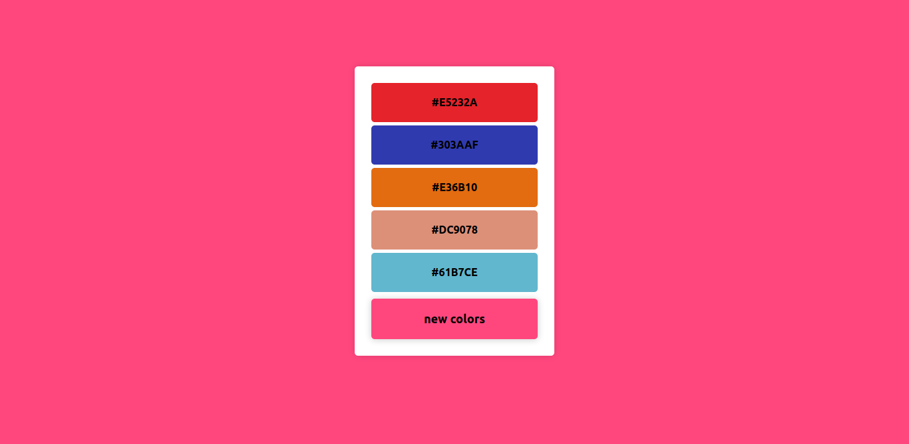

# day-01-in-30-days-of-react 

- that first day I tried to make a color generator on a hexadecimal basis 
- and with this project I learned a little bit of react-hooks (useState) and the structure of using vanilla javascript functions 

# result image  

